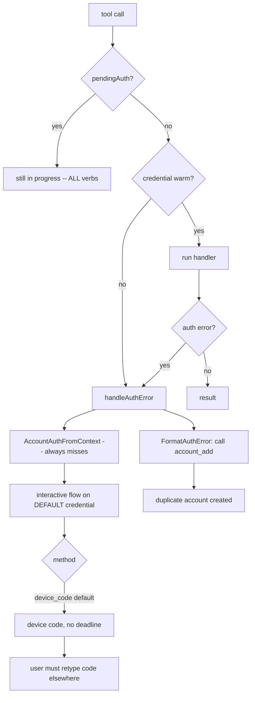
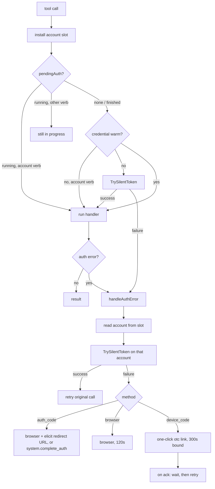

# Authentication resilience and in-band recovery

## Change Summary

A default installation of `outlook-local-mcp` cannot complete authentication without a human stepping outside the conversation, and once authentication is in a bad state the server hides the very verbs that would repair it. This CR fixes the chain end to end: the middleware attempts a silent token refresh before starting any user-visible flow; well-known client IDs infer `auth_code` rather than `device_code`; `system.complete_auth` is always registered; the `account` verbs stay callable while an authentication flow is pending; the recovery guidance the server emits names verbs that actually re-authenticate an existing account; re-authentication targets the account the failing tool call resolved to instead of the server default; and a device code, when one is used, is presented as a one-click link with the code already filled in.

> **Migration cost.** Existing installations that relied on the inferred default will be asked to sign in **once per account** after upgrading. The `auth_code` credential keeps its tokens in a separate MSAL cache blob (`{cache-name}_msal.bin`) from the azidentity keychain entry that `device_code` and `browser` use, so a token cached under the old default is not visible to the new one. Accounts already recorded in `accounts.json` carry a persisted `auth_method` and keep `device_code` until they are re-registered. Setting `OUTLOOK_MCP_AUTH_METHOD=device_code` pins the previous behaviour and avoids the re-authentication entirely. See [Migration cost](#migration-cost) below.

## Motivation and Background

The friction is not one bug; it is six defects that compound into a flow no assistant can finish unaided. Each was verified against `main` at commit `5b22fb5`.

**1. The shipped default requires a human, by construction.** `config.InferAuthMethod` returns `device_code` for any client ID in `WellKnownClientIDs`. The default client ID `outlook-desktop` = `d3590ed6-52b3-4102-aeff-aad2292ab01c` (Microsoft Office) is in that registry, so every out-of-the-box install runs device code. Device code cannot be completed by the assistant: it requires a person to read a code out of a tool result and type it into a page in another window. In an unattended or `claude -p` session there is nobody to do that, and the session stalls.

**2. The in-band alternative is unregistered exactly when it is needed.** `system.complete_auth` is only added to the system verb slice when `cfg.AuthMethod == "auth_code"` (`internal/server/system_verbs.go:212`). Under the default configuration the verb does not exist, so an assistant that has been told "finish the sign-in" discovers there is no verb to call. The per-account `auth_method` can also differ from the server default, so even a correctly configured server can be missing the verb for one of its accounts.

**3. The middleware never asks the cache before asking the user.** `handleAuthError` dispatches straight to an interactive flow. `azidentity`'s `Authenticate()` — the only method the middleware calls — goes directly to `reqToken` with no `AcquireTokenSilent` first (`azidentity@v1.13.1 public_client.go:110-133`). An expired *access* token backed by a perfectly good refresh credential therefore produces a full interactive prompt. Compounding this, the credentials are constructed without `DisableAutomaticAuthentication`, so `GetToken` — which the Graph SDK's bearer-token policy calls on every request — can itself escalate to a browser window or a device code mid-tool-call.

**4. Pending authentication freezes the recovery path.** While `pendingAuth` is set, every `authMW`-wrapped verb returns "Authentication is still in progress" — including `account.login`, `account.list` and `account.refresh`. The device code background goroutine runs on a `context.Background()` with no deadline (`middleware.go:555`), so an abandoned sign-in leaves the flag set for the lifetime of the process. The reads of `pendingDone`/`pendingErr` at middleware entry are also unsynchronised against the writes made elsewhere: a genuine data race.

**5. The recovery guidance is wrong.** `FormatAuthError` tells the LLM to "call account_list, then account_add". `account.add` registers a *new* account; following the instruction produces duplicate registry entries rather than a working session. The correct verb is `account.login`. Separately, `classifyAuthError` tests for the bare string `"authentication required"` before the generic branch, so a specific message such as `"authentication required: device code prompt was not received from Entra ID"` degrades to the contentless "Authentication is required for this account."

**6. Per-account re-authentication targets the wrong account.** `handleAuthError` reads `AccountAuthFromContext`, but `authMW` wraps *outside* `accountResolverMW` (`internal/server/mail_verbs.go:99-101`). The resolver injects the account into a context it derives inside the call, which can never travel back out to the middleware. The lookup therefore always misses and re-authentication always uses the default closure credential, whichever account the tool call targeted. `account_resolver.go:396` compounds this by reporting `"browser"` for every credential that is not an `AuthCodeFlow`, including `DeviceCodeCredential`.

Individually each is survivable. Together they mean: the default install starts a flow the agent cannot finish, does not offer the verb that would finish it, will not let the agent inspect or repair accounts while that flow is outstanding, tells it to run a verb that makes things worse, and — once it does re-authenticate — signs in the wrong account.

## Change Drivers

* Unattended and headless sessions (`claude -p`, CI, Docker) cannot complete the default authentication flow at all.
* Interactive sessions are interrupted by full sign-in prompts that a silent refresh would have avoided.
* The self-repair surface (`account.*`, `system.complete_auth`) is unavailable precisely when authentication is broken.
* Recovery guidance that names the wrong verb actively degrades the registry it is meant to repair.
* A data race in the pending-auth bookkeeping that `go test -race` can surface.
* Multi-account correctness: re-authenticating the default account when a named account failed is silently wrong.

## Current State

| Concern | Behaviour on `main` @ `5b22fb5` | Location |
|---|---|---|
| Inferred method for well-known client IDs | `device_code` | `internal/config/config.go:344` |
| `system.complete_auth` registration | Only when `cfg.AuthMethod == "auth_code"` | `internal/server/system_verbs.go:212` |
| Silent refresh before interactive | None | `internal/auth/middleware.go:210`, `:268` |
| Verbs reachable during pending auth | None | `internal/auth/middleware.go:189-204` |
| Device code background deadline | None (`context.Background()`) | `internal/auth/middleware.go:555` |
| `pendingDone` / `pendingErr` synchronisation | Written under `mu`, read without it | `internal/auth/middleware.go:189-204` |
| Recovery guidance | "call account_list, then account_add" | `internal/auth/errors.go:91-97` |
| Auth-required classification | Bare marker checked before the detailed branch | `internal/auth/errors.go:128-135` |
| Per-account re-auth | Always the default closure credential | `internal/auth/middleware.go:289` |
| Resolver method inference | `"browser"` for everything but `AuthCodeFlow` | `internal/auth/account_resolver.go:396` |
| Device code presentation | Form elicitation with an `acknowledged` checkbox; returns the prompt text either way | `internal/auth/middleware.go:619` |

### Current State Diagram



## Proposed Change

Seven changes, labelled A1-A7, implemented together because each removes one link of the same chain.

| ID | Change |
|---|---|
| A1 | Construct every azidentity credential with `DisableAutomaticAuthentication: true` so `GetToken` is silent-only, then attempt a bounded silent token acquisition before any interactive flow, on both the fresh-credential fast path and the auth-error path, for all three methods. |
| A2 | `InferAuthMethod` returns `auth_code` (source `inferred`) for well-known client IDs. Explicit `OUTLOOK_MCP_AUTH_METHOD` still wins; custom client IDs still default to `browser`. |
| A3 | Register `system.complete_auth` unconditionally; when the target account is not on `auth_code`, return the recovery path that does apply. |
| A4 | Exempt the `account` domain from the pending-auth freeze and the fresh-credential fast path; bound the device code background context at 300s; make the pending-auth bookkeeping race free. |
| A5 | Rewrite the recovery guidance to be correct and method-aware; reorder `classifyAuthError` so specific detail survives. |
| A6 | Hand the resolved account back to the middleware through a mutable context slot; make the resolver's method inference honour the persisted `auth_method` and recognise `DeviceCodeCredential`. |
| A7 | Present device codes as URL-mode elicitations pointing at `https://microsoft.com/devicelogin?otc=<UserCode>`; on acknowledgement, wait for the flow and retry the original call; keep the plain-text fallback verbatim. |

### Proposed State Diagram



## Requirements

### Functional Requirements

1. The middleware **MUST** attempt a non-interactive token acquisition before dispatching to any interactive authentication flow, on both the fresh-credential fast path and inside `handleAuthError`.
2. The silent attempt **MUST** be bounded by a short timeout (5 seconds, matching `silentLoginTimeout` in `internal/tools/login_account.go`).
3. `setupBrowserCredential` and `setupDeviceCodeCredential` **MUST** set `DisableAutomaticAuthentication: true` so that `GetToken` returns `azidentity.AuthenticationRequiredError` on a cache miss rather than escalating.
3a. The silent attempt **MUST NOT** be made against credentials whose `GetToken` can escalate to an interactive flow. Eligibility **MUST** be decided by an explicit allowlist that fails safe for unrecognised credential types, not inferred from an auth-method string.
3b. The deliberate interactive flows **MUST** continue to work; `Authenticate()` bypasses `DisableAutomaticAuthentication` and **MUST** be verified to do so.
3c. `IsAuthError` **MUST** classify `azidentity.AuthenticationRequiredError` as an authentication error so it routes into the middleware, and `classifyAuthError` **MUST NOT** surface its SDK-level "Call Authenticate" advice to the LLM.
3d. `probeStartupToken` **MUST** run for every auth method including `device_code`, so `preAuthenticated` reflects a real token check rather than the presence of an auth record file.
4. On a successful silent acquisition the middleware **MUST** mark itself authenticated and retry the original tool call without prompting.
5. `config.InferAuthMethod` **MUST** return `("auth_code", "inferred")` for client IDs present in `WellKnownClientIDs`.
6. An explicit `OUTLOOK_MCP_AUTH_METHOD` **MUST** continue to win with source `explicit`, including the value `device_code`.
7. Custom (non-well-known) client IDs **MUST** continue to return `("browser", "default")`.
8. `system.complete_auth` **MUST** be registered regardless of the active authentication method.
9. When `system.complete_auth` is invoked against a credential that does not implement `AuthCodeFlow`, the handler **MUST** return a message naming the recovery path for the method that account actually uses, and **MUST NOT** report an internal type error.
10. While a background authentication flow is pending, calls to the `account` aggregate tool **MUST** be passed through to their handlers rather than answered with the pending message.
11. On the fresh-credential fast path, calls to the `account` aggregate tool **MUST** be passed through to their handlers rather than diverted into an authentication flow.
12. The device code background authentication context **MUST** carry a 300-second deadline so the pending flag clears without operator intervention.
13. The pending-authentication completion channel and error **MUST** be published such that concurrent readers observe them without a data race.
14. `FormatAuthError` **MUST NOT** instruct the caller to add a new account as the primary recovery step. The guidance **MUST** name `account.login` for re-authenticating an existing account.
15. A method-aware variant **MUST** exist so that `auth_code` guidance additionally names `system.complete_auth`.
16. `classifyAuthError` **MUST** preserve explanatory detail that follows an `authentication required` marker instead of collapsing it to the bare message.
17. `AuthMiddleware` **MUST** install a mutable slot into the request context before invoking the handler chain, and `AccountResolver` **MUST** record the resolved `AccountAuth` in that slot.
18. `handleAuthError` **MUST** prefer the slot value over the closure credential when re-authenticating.
19. `auth.inferAuthMethod(entry)` **MUST** honour a persisted `AccountEntry.AuthMethod` and, when it is empty, **MUST** distinguish `*azidentity.DeviceCodeCredential` from the browser case.
20. `presentDeviceCode` **MUST** use URL-mode elicitation with a link of the form `https://microsoft.com/devicelogin?otc=<UserCode>`.
21. The structured device code message (`UserCode`, `VerificationURL`, `Message`) **MUST** be forwarded through `DeviceCodeMsgKey`, not just the rendered sentence.
22. When elicitation is unavailable or fails, the device code prompt **MUST** be returned as tool result text **verbatim**, preserving the CR-0031 fallback contract.
23. After a successful elicitation acknowledgement, `presentDeviceCode` **MUST** wait (bounded) for the background flow to finish and then retry the original tool call.

### Non-Functional Requirements

24. No new top-level MCP tool is introduced; the four-domain surface from CR-0060 is unchanged.
25. The aggregate MCP annotations for the `system` tool **MUST** remain the most conservative across its verbs. (They already assume `complete_auth` is present, so they do not change.)
26. `go test -race ./...` **MUST** pass.
27. Files added to `internal/auth` **MUST** stay small and single-purpose per AGENTS.md; `middleware.go` **MUST NOT** grow.

## Migration cost

This is the one user-visible cost of the CR and it is deliberate.

**What happens.** After upgrading, an installation that relied on the inferred default and has no `OUTLOOK_MCP_AUTH_METHOD` set will run `auth_code` where it previously ran `device_code`. The first tool call will ask the user to sign in.

**Why a cached token does not carry over.** The two methods use different token stores:

| Method | Credential | Token store |
|---|---|---|
| `device_code`, `browser` | `azidentity.DeviceCodeCredential` / `InteractiveBrowserCredential` | `azidentity/cache` entry named `cfg.CacheName` (OS keychain / libsecret / DPAPI, or the encrypted file backend) |
| `auth_code` | `auth.AuthCodeCredential` (MSAL Go `public.Client`) | its own MSAL cache blob, `{cfg.CacheName}_msal.bin`, via `InitMSALCache` |

They are separate blobs with separate serialisation. There is no supported way to import one into the other, and attempting it would mean hand-decoding MSAL's on-disk format.

**How large the cost is.** Exactly one interactive sign-in per account, once. After that, tokens renew silently — and thanks to A1 they renew more reliably than before.

**What limits the blast radius.**

* Accounts already persisted in `accounts.json` carry an `auth_method` field. `RestoreAccounts` rebuilds them with that method, so an account registered as `device_code` **keeps** `device_code` after the upgrade and is not affected at all. Only the server default changes.
* Setting `OUTLOOK_MCP_AUTH_METHOD=device_code` restores the previous behaviour completely.
* The re-authentication is a normal `account.login`, which the assistant can now drive end to end — which is the point of the change.

The recovery procedure is documented at [troubleshooting#reauth-after-upgrade](../troubleshooting.md#reauth-after-upgrade).

## Affected Components

| Component | Change |
|---|---|
| `internal/config/config.go` | `InferAuthMethod` returns `auth_code` for well-known client IDs; doc comments updated. |
| `internal/auth/silent.go` *(new)* | `SilentTokenCredential` capability interface, `silentOnlyAcquirer` eligibility allowlist, and `TrySilentToken`. |
| `internal/auth/pending.go` *(new)* | `pendingAuthAttempt` and the race-free state helpers `begin`, `settle`, `pendingOutcome`. |
| `internal/auth/account_slot.go` *(new)* | Mutable per-request `accountAuthSlot` and `resolvedAccountAuth`. |
| `internal/auth/recovery_ops.go` *(new)* | `isRecoveryOperation`. |
| `internal/auth/devicecode_prompt.go` *(new)* | `DeviceCodePrompt` and `OneClickURL`. |
| `internal/auth/devicecode_present.go` *(new)* | URL-mode presentation, acknowledgement wait, verbatim fallback. |
| `internal/auth/middleware.go` | Entry-point restructure, silent attempt, slot install, pending rework, background deadlines on both interactive flows; `presentDeviceCode` moved out. |
| `cmd/outlook-local-mcp/main.go` | `probeStartupToken` no longer special-cases `device_code`; the `authRecordPath` parameter is dropped. |
| `internal/auth/errors.go` | `FormatAuthErrorFor`, `recoverySteps`, `authRequiredDetail`, an `AuthenticationRequiredError` branch, reordered classification. |
| `internal/auth/authcode.go` | `SilentOnly` marker. |
| `internal/auth/auth.go` | `DisableAutomaticAuthentication: true` on both azidentity credentials; `DeviceCodeMsgKey` channel element type becomes `DeviceCodePrompt`. |
| `internal/auth/account_resolver.go` | Slot hand-back; `inferAuthMethod` honours persisted method and recognises `DeviceCodeCredential`. |
| `internal/server/system_verbs.go` | Unconditional `complete_auth` registration; verb reference updated. |
| `internal/tools/complete_auth.go` | Accepts the default auth method; method-aware unavailability message. |
| `internal/tools/complete_auth_guidance.go` *(new)* | `completeAuthUnavailable`. |
| `internal/tools/add_account.go` | Device code channel element type. |
| `extension/manifest.json` | `system` tool description no longer claims `complete_auth` is conditional. |
| `docs/concepts.md`, `docs/troubleshooting.md`, `docs/reference/auth-flows.md` | Narrative, failure modes and contributor reference brought in line. |

## Scope Boundaries

### In Scope

* A1-A7 as listed above.
* Test updates for every behaviour changed, plus new tests for each new behaviour.
* The three documentation files named above and this CR.

### Out of Scope ("Here, But Not Further")

* **Migrating tokens between the azidentity cache and the MSAL blob.** Rejected; see Migration cost.
* **Silent refresh on the fresh-credential fast path for a named account.** That path never invokes the handler chain, so `AccountResolver` never runs and no account is available to target. The default credential is used. Fixing it would require moving account resolution outside the auth middleware, which is a larger restructuring.
* Changing the four-domain tool surface, adding verbs, or altering read/write gating.

## Rejected alternatives

### Making `browser` the default for well-known client IDs

`browser` is the flow with the best user experience — no code to transcribe, no URL to paste — so it is the obvious candidate. It cannot be the default, for a hard external reason.

`InteractiveBrowserCredential` starts a local HTTP listener on a random port and uses `http://localhost:<port>` as the OAuth redirect URI. The Microsoft Office app registration (`d3590ed6-52b3-4102-aeff-aad2292ab01c`), which is the shipped default client ID and the only well-known ID with `Calendars.ReadWrite` pre-authorized, **does not register `http://localhost` as a redirect URI**. Entra ID rejects the request outright:

```
AADSTS50011: The redirect URI 'http://localhost:<port>' specified in the request
does not match the redirect URIs configured for the application.
```

This is documented in [CR-0030](CR-0030-manual-auth-code-flow.md) and is the original reason the `auth_code` method exists. The same app registration *does* include `https://login.microsoftonline.com/common/oauth2/nativeclient`, which is exactly what `auth_code` uses. Defaulting well-known client IDs to `browser` would therefore ship a configuration that fails on its first tool call, for every user, with an error that looks like a misconfiguration on their side.

`browser` remains the correct default for **custom** app registrations, which normally do register a localhost redirect URI — and that is unchanged by this CR.

### Keeping `device_code` as the default and only fixing the surrounding friction

Considered and rejected. A1, A3, A4, A5 and A7 all make device code materially better, and the one-click `otc` link removes the transcription step. But the flow still terminates in a human approving a sign-in on a page the assistant cannot reach. No amount of surrounding polish makes it completable in an unattended session, which is the failure this CR exists to remove. Device code stays fully supported and one environment variable away.

### Probing credentials with `GetToken` without disabling automatic authentication

Unsafe as written, and the reason A1 grew a construction-site change. `azidentity`'s `publicClient.GetToken` tries `AcquireTokenSilent` and then falls through to `reqToken` when the cache misses (`azidentity@v1.13.1 public_client.go:135-156`). For `InteractiveBrowserCredential` that opens a browser window; for `DeviceCodeCredential` it emits a fresh device code. With a 5-second timeout the call is then abandoned, leaving an orphaned browser tab or an unusable code — on **every** tool call. The Graph SDK's bearer-token policy calls `GetToken` on every request, so the same hazard exists outside the middleware entirely.

`DisableAutomaticAuthentication` suppresses exactly this: with it set, `GetToken` returns `AuthenticationRequiredError` instead of calling `reqToken`. The option is declared on **both** `InteractiveBrowserCredentialOptions` (`interactive_browser_credential.go:44-47`) and `DeviceCodeCredentialOptions` (`device_code_credential.go:45-48`), and both wire it into `publicClientOptions` (`:93` and `:113` respectively). This CR therefore sets it on both credentials rather than excluding them from the probe.

*(An earlier draft of this CR asserted that the option existed only on `InteractiveBrowserCredentialOptions`. That was wrong — the claim came from a truncated grep — and it would have limited A1's benefit to `auth_code` users only. The verification below is the corrected reading.)*

The probe is still gated rather than universal, because the guarantee is a property of how a credential was constructed, not of its type. `silentOnlyAcquirer` allows `*AuthCodeCredential` (which declares `SilentOnly()` natively, being silent-only by construction) plus the two azidentity types this package builds with the flag, and skips anything else. A future credential added without the flag is therefore not probed, rather than silently prompting.

### Wrapping the azidentity credentials to carry a `SilentOnly()` marker

The type-system-pure alternative to the allowlist: wrap each azidentity credential in a local type that adds the marker method. Rejected because the wrapper would become the credential every consumer sees — `AccountEntry.Credential`, `AccountAuth.Authenticator`, the Graph client constructor, and the three existing tests that assert `SetupCredential` returns the concrete azidentity types — forcing an unwrap step throughout for one bit of information. The allowlist keeps the credential transparent and pins the invariant behaviourally instead: `TestSetupCredential_GetTokenIsSilentOnly` asserts that `GetToken` returns `AuthenticationRequiredError`, which azidentity produces *only* on the `DisableAutomaticAuthentication` branch. Removing the flag fails that test.

## Impact Assessment

### User Impact

Positive in steady state: fewer prompts, and the prompts that remain can be completed inside the conversation. One-off negative: a single re-authentication per account on upgrade, described above and pinnable with one environment variable.

### Technical Impact

Removes a data race. Removes an unbounded background context. Corrects a multi-account correctness bug that silently signed in the wrong account. Adds six small files to `internal/auth` and one to `internal/tools`; `middleware.go` shrinks.

### Business Impact

Makes the server usable in unattended and headless contexts, which is where an MCP server spends most of its life.

## Implementation Approach

### A1: Silent refresh before any interactive flow

Set `DisableAutomaticAuthentication: true` in `setupBrowserCredential` and `setupDeviceCodeCredential`, making `GetToken` silent-only for all three methods. Add `internal/auth/silent.go` with the `SilentTokenCredential` opt-in interface, the `silentOnlyAcquirer` eligibility allowlist, and `TrySilentToken`. Mark `*AuthCodeCredential` with `SilentOnly()`. Call `TrySilentToken` on the fresh-credential fast path and at the top of `handleAuthError` after the account is resolved. Add a `classifyAuthError` branch for `azidentity.AuthenticationRequiredError`, and drop the `device_code` special case from `probeStartupToken` in `cmd/outlook-local-mcp/main.go`.

Verified consequences of the flag:

* `Authenticate()` is unaffected — it calls `reqToken` directly and never reads the option (`public_client.go:110-133`, and the comment at `:159` that `reqToken` is "separate from GetToken() to enable Authenticate() to bypass the cache"). The deliberate interactive flows still prompt.
* The resulting `AuthenticationRequiredError` message begins with the credential name — literally `"DeviceCodeCredential"` or `"InteractiveBrowserCredential"` — both of which are already in `authErrorPatterns`, so `IsAuthError` classifies it without change. A regression test pins this.
* The Graph SDK's bearer-token policy now receives that error instead of triggering a prompt mid-request, and the error routes into `AuthMiddleware`, which is the designed prompt path.

### A2: Infer `auth_code` for well-known client IDs

One-line change in `InferAuthMethod` plus the doc comment that justified `device_code`. Update `config_test.go`.

### A3: Always register `system.complete_auth`

Remove the `if` in `buildSystemVerbs`; move `completeAuthVerb` into the base slice. Thread `cfg.AuthMethod` into `HandleCompleteAuth` and replace the "Internal error" branch with `completeAuthUnavailable`. Update the verb `Description`/`Examples`/`SeeDocs` and the manifest.

### A4: Stop freezing the session during pending auth

Add `pending.go` (`pendingAuthAttempt`, `begin`, `settle`, `pendingOutcome`, `backgroundAuthTimeout`) and `recovery_ops.go` (`isRecoveryOperation`). Restructure the middleware entry point. Bound both the device code and the browser background auth contexts at `backgroundAuthTimeout` (300s); both previously ran on an unbounded `context.Background()`.

### A5: Correct the recovery guidance

Add `FormatAuthErrorFor` and `recoverySteps`; keep `FormatAuthError` as the method-agnostic wrapper. Replace the substring test in `classifyAuthError` with `authRequiredDetail`. Pass the resolved method at each middleware call site.

### A6: Per-account re-auth wiring

Add `account_slot.go`. Install the slot in the middleware entry point, fill it in `AccountResolver`, read it via `resolvedAccountAuth` in `handleAuthError`. Rewrite `inferAuthMethod(entry)`.

### A7: One-click device code

Add `devicecode_prompt.go` (`DeviceCodePrompt`, `OneClickURL`) and `devicecode_present.go`. Change the `DeviceCodeMsgKey` channel element type and update every writer and reader, including `internal/tools/add_account.go`.

## Test Strategy

### Tests to Add

* `internal/auth/silent_test.go` — nil credential; successful and failing silent acquisition; **the escalating credential is never probed**; `*AuthCodeCredential` satisfies `SilentTokenCredential`.
* `internal/auth/devicecode_prompt_test.go` — field round trip; `OneClickURL` with and without a user code, with and without a verification URL, with pre-existing query parameters.
* `internal/auth/recovery_ops_test.go` — domain classification.
* `internal/auth/middleware_cr0067_test.go` — pending auth blocks an ordinary verb but allows an `account` verb; a fresh credential allows an `account` verb without starting a flow; a successful silent refresh skips the prompt on both paths; `AccountResolver` hands the account back so re-auth targets it; `inferAuthMethod` per entry shape; `pendingOutcome` transitions; classification preserves device code detail; method-specific recovery steps never mention `operation="add"`.
* `internal/tools/complete_auth_test.go` — table-driven unavailability message per method.
* `internal/auth/silent_test.go` — `TestSetupCredential_GetTokenIsSilentOnly` (both azidentity methods yield `AuthenticationRequiredError`, are recognised by `IsAuthError`, and are probe-eligible); `TestSilentOnlyAcquirer_Eligibility`; `TestClassifyAuthError_AuthenticationRequiredError`.

### Tests to Modify

* `internal/config/config_test.go` — default and well-known inference now expect `auth_code`; an explicit `device_code` case is added.
* `internal/auth/errors_test.go`, `internal/auth/middleware_test.go` — guidance assertions move from `account_list`/`account_add` to `operation="list"`/`operation="login"`.
* `internal/auth/middleware_test.go` — device code channel element type; the former form-elicitation test becomes a URL-elicitation test asserting the `otc` parameter and the retry.
* `internal/tools/add_account_test.go` — device code channel element type.
* `cmd/outlook-local-mcp/main_test.go` — the two `device_code`-skip subtests are replaced by subtests asserting the probe now calls `GetToken` for `device_code`; the `authRecordPath` argument is dropped from all call sites.

### Tests to Remove

None.

## Acceptance Criteria

### AC-1: Silent refresh precedes interactive auth and never escalates

A probe-eligible credential with a warm cache causes the original tool call to be retried with no authentication flow started, on both the fast path and the auth-error path. An unrecognised credential with a `GetToken` method is never called. `SetupCredential` returns credentials whose `GetToken` yields `azidentity.AuthenticationRequiredError` on a cache miss for both `browser` and `device_code`, `IsAuthError` classifies that error as authentication-related, and `classifyAuthError` does not surface its "Call Authenticate" text. `probeStartupToken` calls `GetToken` for `device_code` and marks pre-authenticated only on success.

### AC-2: Default inference is `auth_code`

`InferAuthMethod("d3590ed6-...", "")` returns `("auth_code", "inferred")`. `InferAuthMethod("d3590ed6-...", "device_code")` returns `("device_code", "explicit")`. `InferAuthMethod("<custom-uuid>", "")` returns `("browser", "default")`.

### AC-3: `complete_auth` always exists and always answers usefully

`system.complete_auth` appears in the registry under every auth method. Called against a `browser` account it names the browser recovery path; against `device_code`, the device login page; with no known method, `system.status` plus `account.login`. The aggregate `system` annotations are unchanged.

### AC-4: Recovery stays reachable and pending state self-clears

With a pending flow, a `calendar` call returns the pending message and an `account` call runs. With a cold credential, an `account` call runs without triggering authentication. The device code background context carries a 300s deadline. `go test -race ./...` is clean.

### AC-5: Guidance is correct and method-aware

No `FormatAuthError` output names `operation="add"` as the primary step. `auth_code` guidance names `system.complete_auth`. `classifyAuthError("authentication required: device code prompt was not received from Entra ID")` retains "device code prompt was not received".

### AC-6: Re-auth targets the resolved account

With one registered account whose authenticator differs from the closure credential, an auth error inside the resolved handler re-authenticates the account credential and not the closure credential.

### AC-7: Device code is one click, with the fallback intact

URL elicitation is called with a URL containing `otc=<UserCode>`. On acceptance the original tool call is retried. On `ErrElicitationNotSupported` the tool result text equals the Entra ID message verbatim.

## Quality Standards Compliance

### Verification Commands

```bash
make docs-bundle build vet fmt-check tidy test
go test -race ./...
golangci-lint run --timeout 15m
```

### Documentation

Per the AGENTS.md documentation governance rules: per-verb reference for `complete_auth` lives in the `Verb` registry (`Description`, `Examples`, `SeeDocs`), not in markdown. Narrative concepts go to `docs/concepts.md`; failure modes to `docs/troubleshooting.md` with stable anchors; internals to `docs/reference/auth-flows.md`, which is not embedded.

## Risks and Mitigation

### Risk 1: Users are surprised by the re-authentication prompt

**Mitigation:** A dedicated troubleshooting entry with a stable anchor (`#reauth-after-upgrade`), a prominent note in this CR, and a one-variable opt-out. The prompt itself is now completable in band, which is the compensating benefit.

### Risk 2: `auth_code` is a worse fit for some environment than `device_code`

**Mitigation:** `device_code` is unchanged in capability and is one environment variable away. A1, A4, A5 and A7 improve it regardless of which is the default.

### Risk 3: The silent refresh adds latency to the auth-error path

**Mitigation:** Bounded at 5 seconds, and only attempted for credentials that cannot escalate. The silent path is a local cache read plus at most one refresh round trip; on a miss with an empty cache it returns immediately without touching the network (measured at ~150µs). The alternative it replaces is a full interactive sign-in.

### Risk 3a: `DisableAutomaticAuthentication` changes Graph SDK behaviour for existing `browser` and `device_code` users

**Mitigation:** The change is a strict improvement in this architecture. Previously the Graph SDK's bearer-token policy could open a browser window or emit a device code in the middle of an unrelated tool call, outside any middleware coordination. Now it returns an error that `IsAuthError` recognises and `AuthMiddleware` turns into a coordinated, user-visible prompt — the designed path since CR-0022. The deliberate interactive flows are untouched because `Authenticate()` bypasses the option. `TestSetupCredential_GetTokenIsSilentOnly` pins the option; the existing browser and device code middleware tests pin the interactive flows.

### Risk 4: Exempting the `account` domain weakens a safety property

**Mitigation:** The exemption is a pass-through, not a privilege escalation. Every `account` verb either reads registry state or drives its own authentication; none of them relies on the middleware having authenticated first. Auth-error detection on their results is unchanged.

### Risk 5: The device code channel type change breaks an unnoticed writer

**Mitigation:** The element type change is compile-visible at every `make(chan ...)` site; the only risk is a `ctx.Value(...).(chan string)` assertion silently returning false. All such assertions in the repository were located and updated, and the device code tests exercise both the middleware and `add_account` paths.

### Risk 6: The fresh-credential fast path still re-authenticates the default account

**Mitigation:** Documented as an explicit out-of-scope limitation rather than silently accepted. It only affects the very first tool call against a completely cold server, where there is no resolved account to prefer anyway.

## Dependencies

* CR-0022 (lazy authentication) — the middleware this CR restructures.
* CR-0024 (browser auth) — the flow whose default status is narrowed to custom client IDs.
* CR-0030 (manual auth code flow) — provides `auth_code` and documents the `AADSTS50011` constraint that rules out `browser` as the default.
* CR-0031 (elicitation fallback) — the verbatim plain-text contract A7 must preserve.
* CR-0060 (aggregate domain tools) — the `{domain}.{operation}` identity that A4 classifies on.
* CR-0065 (documentation architecture) — the placement rules the documentation changes follow.

## Estimated Effort

Medium. Seven coupled changes in one package plus mechanical test updates across two more; no new external dependencies and no schema changes.

## Decision Outcome

Proposed.

## Implementation Status

Proposed — not yet accepted.

## Related Items

* [CR-0022](CR-0022-improved-authentication-flow.md)
* [CR-0024](CR-0024-interactive-browser-auth-default.md)
* [CR-0030](CR-0030-manual-auth-code-flow.md)
* [CR-0031](CR-0031-elicitation-fallback.md)
* [CR-0060](CR-0060-domain-aggregated-tools-with-verb-operations.md)
* [CR-0065](CR-0065-user-documentation-architecture-and-registry-driven-tool-reference.md)

## More Information

### Why the silent-refresh capability is a marker interface

`azcore.TokenCredential` is already a one-method interface, so it is tempting to depend on it directly. It is the wrong abstraction here: the middleware does not need "something that can produce a token", it needs "something that can produce a token *without interrupting the user*". Those are different contracts and only the second one is safe to call speculatively. Encoding it as an empty `SilentOnly()` marker makes the promise explicit at the type level and makes the unsafe case a compile-time non-participant rather than a runtime string comparison against `authMethod`.

### Evidence for the azidentity escalation behaviour

`azidentity@v1.13.1`, `public_client.go`:

* `Authenticate` (line 110) calls `p.reqToken` directly — no `AcquireTokenSilent`. This is the only method `AuthMiddleware` ever called before this CR.
* `GetToken` (line 135) calls `AcquireTokenSilent` first, returns `newAuthenticationRequiredError` if `DisableAutomaticAuthentication` is set, and otherwise falls through to `p.reqToken` (line 155).
* `reqToken` (line 159) dispatches on credential name: `AcquireTokenInteractive` for `credNameBrowser`, `AcquireTokenByDeviceCode` plus the `DeviceCodePrompt` callback for `credNameDeviceCode`.
* `DisableAutomaticAuthentication` is declared on **both** `InteractiveBrowserCredentialOptions` (`interactive_browser_credential.go:44-47`, wired at `:93`) and `DeviceCodeCredentialOptions` (`device_code_credential.go:45-48`, wired at `:113`). Setting it on both is what makes A1 safe and beneficial for all three authentication methods.
* Empirically, a `DeviceCodeCredential` constructed with the flag and an empty cache returns `AuthenticationRequiredError` in ~150µs with no network call and without invoking the `UserPrompt` callback.
