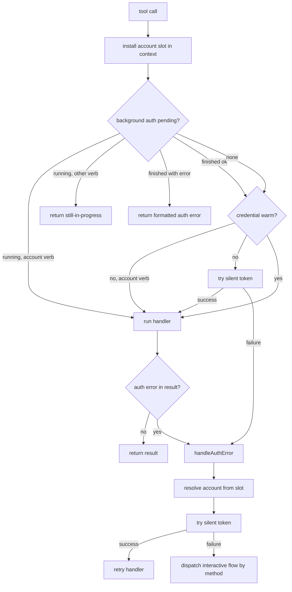
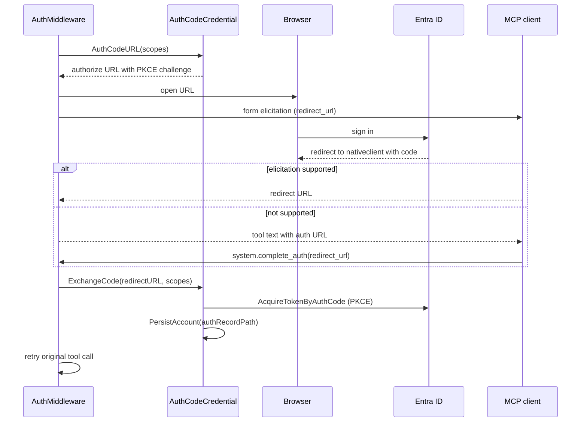

# Authentication Flows

Contributor reference for the three authentication methods, the middleware state machine that drives them, and the token stores behind them. For the user-facing overview see [docs/concepts.md](../concepts.md); for failure modes see [docs/troubleshooting.md](../troubleshooting.md).

Code: `internal/auth/` (`auth.go`, `authcode.go`, `middleware.go`, `silent.go`, `pending.go`, `account_slot.go`, `recovery_ops.go`, `devicecode_prompt.go`, `devicecode_present.go`), `internal/config/config.go` (`InferAuthMethod`).

---

## The client ID choice

The server defaults to the **Microsoft Office** first-party client ID **`d3590ed6-52b3-4102-aeff-aad2292ab01c`** (friendly name `outlook-desktop`). It is the only well-known client ID confirmed to have `Calendars.Read` and `Calendars.ReadWrite` pre-authorized for Microsoft Graph (`00000003-0000-0000-c000-000000000000`). The Azure CLI client ID (`04b07795-8ddb-461a-bbee-02f9e1bf7b46`) does **not** support calendar scopes and fails with `AADSTS65002`.

This choice constrains which flows can work:

| Redirect URI | Registered on the MS Office app? | Consequence |
|---|---|---|
| `http://localhost:<port>` | No | The `browser` flow fails with `AADSTS50011` |
| `https://login.microsoftonline.com/common/oauth2/nativeclient` | Yes | Registered, but the `auth_code` flow is now blocked by an anti-phishing interstitial on that page |
| *(none — device code grant)* | n/a | The `device_code` flow works, subject to Conditional Access |

Net result: `device_code` is the only flow that completes against these client IDs. Original analysis in [CR-0030](../cr/CR-0030-manual-auth-code-flow.md); the `auth_code` regression and the live `AADSTS50011` re-confirmation are recorded in [CR-0067](../cr/CR-0067-authentication-resilience-and-in-band-recovery.md).

### Tenant ID configuration

| Value | Supported accounts | Recommendation |
|---|---|---|
| `"common"` | Work/school + personal Microsoft accounts | **Default**, broadest compatibility |
| `"organizations"` | Work/school accounts only | Use if personal accounts should be excluded |
| `"consumers"` | Personal Microsoft accounts only (Outlook.com) | Use for personal-only scenarios |
| `"<tenant-guid>"` | Single specific tenant | Use for enterprise lockdown |

---

## Method selection

`config.InferAuthMethod(clientID, explicitAuthMethod)` returns the effective method and the source that decided it. `Config.AuthMethodSource` records the source for `system.status`.

| Condition | Method | Source |
|---|---|---|
| `OUTLOOK_MCP_AUTH_METHOD` set | that value | `explicit` |
| Client ID is in `config.WellKnownClientIDs` | `device_code` | `inferred` |
| Anything else (custom app registration) | `browser` | `default` |

`device_code` is inferred for the first-party client IDs because it is the only flow that completes against them. CR-0067 trialled `auth_code` as the inferred default and reverted it on live evidence:

* **`browser`** — `AADSTS50011`, confirmed end to end with `http://localhost:65053`. The app registration has no localhost redirect URI.
* **`auth_code`** — Microsoft now shows an anti-phishing interstitial on the `nativeclient` redirect page ("The URL contains your password... do not copy or share the URL with anyone") and then refuses with "You have reached the wrong page". Copying an authorization code out of the address bar is the pattern being hardened against.

Both remain fully implemented. `auth_code` is selectable explicitly and may work against a custom app registration; `browser` is the correct default for one.

> **Testing caution.** A `curl` against `/authorize` with an unregistered `redirect_uri` still renders a login page. Entra ID defers redirect URI validation until after authentication, so a successful page render proves nothing. Only a completed sign-in surfaces `AADSTS50011`. This produced a false negative during the CR-0067 investigation.

Per-account methods override the server default. `AccountEntry.AuthMethod` is persisted in `accounts.json` and is authoritative for that account; `auth.inferAuthMethod(entry)` falls back to inspecting the credential type only when the field is empty.

---

## Credential types

| Method | Type | Interactive entry point | `GetToken` behaviour on cache miss |
|---|---|---|---|
| `auth_code` | `auth.AuthCodeCredential` (wraps MSAL Go `public.Client`) | `AuthCodeURL` + `ExchangeCode` | Returns `authentication required`; **never** escalates |
| `browser` | `azidentity.InteractiveBrowserCredential` | `Authenticate` | Returns `AuthenticationRequiredError` — see below |
| `device_code` | `azidentity.DeviceCodeCredential` | `Authenticate` | Returns `AuthenticationRequiredError` — see below |

By default the two azidentity credentials do **not** stop at the cache: `publicClient.GetToken` tries `AcquireTokenSilent` and then falls through to `reqToken`, which opens a browser window for `InteractiveBrowserCredential` and emits a fresh device code for `DeviceCodeCredential` (`public_client.go:135-156`). Because the Graph SDK's bearer-token policy calls `GetToken` on every request, that default would let an expired token pop a browser in the middle of an unrelated tool call.

`setupBrowserCredential` and `setupDeviceCodeCredential` therefore both set **`DisableAutomaticAuthentication: true`** (declared on `InteractiveBrowserCredentialOptions:44-47` and `DeviceCodeCredentialOptions:45-48`). `GetToken` then returns `azidentity.AuthenticationRequiredError` on a miss, which `IsAuthError` recognises — its message begins with the credential name, already an `authErrorPatterns` entry — so the failure routes into `AuthMiddleware` and becomes a coordinated prompt.

`Authenticate()` is unaffected: it calls `reqToken` directly and never reads the option (`public_client.go:110-133`; the comment at `:159` notes `reqToken` is "separate from GetToken() to enable Authenticate() to bypass the cache"). The deliberate interactive flows still prompt exactly as before.

---

## Lazy authentication

Authentication is **not** performed at startup. `SetupCredential` constructs a credential and returns; the first tool call drives whatever flow is needed. This was introduced by CR-0022 and replaced an earlier design that blocked in `main` until the user signed in.

`main.go` does perform a startup *probe* (`probeStartupToken`): a bounded silent `GetToken` that, on success, calls `markPreAuthenticated` so the middleware knows the credential is warm. It runs for every method. Before CR-0067 it was skipped for `device_code`, because a cache miss there would have emitted a device code nobody asked for, and readiness was guessed at from the presence of an auth record file; now that every credential is silent-only the probe asks the credential directly.

---

## Middleware state machine

`auth.AuthMiddleware` wraps every calendar, mail, account and `system.complete_auth` verb. Per call:



Key properties, all introduced or corrected by CR-0067:

- **Silent before interactive.** `auth.TrySilentToken` runs before any user-visible flow, both on the fresh-credential fast path and inside `handleAuthError`, for all three methods. Eligibility is decided by `silentOnlyAcquirer`, which allows `*AuthCodeCredential` (it declares `SilentOnly()`, being silent-only by construction) plus the two azidentity types this package builds with `DisableAutomaticAuthentication`. Anything else is skipped, so a credential type added later without the flag fails safe instead of prompting. `TestSetupCredential_GetTokenIsSilentOnly` pins the invariant behaviourally, since the SDK keeps the option in an unexported field.
- **Recovery verbs are never gated.** `isRecoveryOperation` matches calls to the `account` aggregate tool. Those verbs bypass both the "still in progress" response and the fresh-credential fast path, so `account.list` and `account.login` work even when nothing else does.
- **Pending state is race free.** A background attempt is a `pendingAuthAttempt` published through an `atomic.Pointer`. Its `err` field is written once and then `done` is closed, so a reader that has observed the close sees the final value without a lock. The completing goroutine cannot take `authMiddlewareState.mu` — `handleAuthError` holds it while waiting — which is why the previous field-based design raced.
- **Pending state self-clears.** Both the browser and device code background contexts are bounded at `backgroundAuthTimeout` (300s); both previously ran on an unbounded `context.Background()`. An abandoned sign-in releases the pending flag instead of freezing the process.

### Per-account re-authentication

`AuthMiddleware` wraps `AccountResolver`, not the reverse (see `internal/server/mail_verbs.go`). The resolver's `WithAccountAuth` therefore lands on a context derived *inside* the middleware call and cannot travel back out. `account_slot.go` closes the loop: the middleware installs a mutable `accountAuthSlot` pointer in the context before calling the chain, the resolver fills it in, and `handleAuthError` reads it through `resolvedAccountAuth`.

One case remains unresolved by design: the fresh-credential fast path never calls the handler, so the resolver never runs and no account is recorded. Re-authentication there uses the server default credential.

---

## Flow: `auth_code`

Synchronous, driven by `handleAuthCodeAuth`.



`system.complete_auth` is registered unconditionally (CR-0067), so it does not disappear when the active method changes. When the target account is not running `auth_code`, `tools.completeAuthUnavailable` returns the recovery path that does apply rather than an internal type error.

**Status:** this flow is implemented and selectable but is no longer inferred. Against the first-party client IDs the redirect page now interposes an anti-phishing warning and the exchange does not complete; see Method selection above.

## Flow: `browser`

`handleBrowserAuth` announces the login page via URL elicitation (falling back to a log notification), then runs `Authenticate` in a background goroutine (bounded by `backgroundAuthTimeout`, 300s) while waiting up to `browserTimeout` (120s default) for it to finish. `InteractiveBrowserCredential` opens the system browser and listens on a localhost port. On success the original tool call is retried.

## Flow: `device_code` (the default)

`handleDeviceCodeAuth` starts `Authenticate` in a background goroutine with a `chan DeviceCodePrompt` in the context under `DeviceCodeMsgKey`. The credential's `UserPrompt` callback (`deviceCodeUserPrompt`) forwards the whole `azidentity.DeviceCodeMessage` — not just its rendered sentence — so the receiver can build a one-click URL.

`presentDeviceCode` then:

1. Composes `DeviceCodePrompt.OneClickURL()` — the verification URL with `?otc=<UserCode>`, which pre-fills the code box on the device login page.
2. Requests a **URL mode** elicitation for that link.
3. On acknowledgement, waits (bounded by `browserTimeout`) for the background attempt and retries the original tool call.
4. On any elicitation error — including `ErrElicitationNotSupported` — returns `prompt.FallbackText()`: the Entra ID message **verbatim**, followed by the same one-click link. Per [CR-0031](../cr/CR-0031-elicitation-fallback.md), some clients answer elicitation with "Method not found" and this text is the only channel that reaches the user, so the message must never be reworded or dropped; the link is additive. Since `device_code` is the inferred default and many clients cannot elicit, this is the sign-in surface most users actually see.

---

## OAuth scopes

`auth.Scopes(cfg)` builds the requested scope set:

| Configuration | Scopes |
|---|---|
| Default | `Calendars.ReadWrite` |
| `OUTLOOK_MCP_MAIL_ENABLED=true` | `Calendars.ReadWrite`, `Mail.Read` |
| `OUTLOOK_MCP_MAIL_MANAGE_ENABLED=true` | `Calendars.ReadWrite`, `Mail.ReadWrite` |

`offline_access` is added automatically by the identity library. `Mail.Send` is never requested. `Calendars.ReadWrite` is a delegated permission that does not require admin consent and covers invitations, cancellations and Teams online meetings, so no `OnlineMeetings.ReadWrite` scope is needed.

---

## Token storage

Three distinct stores are in play. Knowing which flow writes which one explains why switching a running installation between `auth_code` and the other two methods costs one interactive sign-in.

### 1. azidentity persistent cache

`internal/auth/cache_cgo.go` / `cache_nocgo.go` initialise `azidentity/cache` with `Name: cfg.CacheName`. Tokens land in macOS Keychain, Linux libsecret, or Windows DPAPI. Used by the `browser` and `device_code` credentials. `OUTLOOK_MCP_TOKEN_STORAGE` (`auto`, `keychain`, `file`) selects the backend; the `file` backend is an AES-256-GCM encrypted file for headless hosts with no keyring.

### 2. MSAL cache blob (`auth_code` only)

`AuthCodeCredential` uses MSAL Go's own cache accessor via `InitMSALCache`, stored under `{cfg.CacheName}_msal.bin`. It is **separate** from store 1. A token cached by the `device_code` credential is therefore invisible to the `auth_code` credential and vice versa, so setting `OUTLOOK_MCP_AUTH_METHOD=auth_code` on an existing installation costs one interactive sign-in per account. CR-0067 leaves the inferred default alone, so no upgrade triggers this.

### 3. Authentication record

`azidentity.AuthenticationRecord` is non-secret metadata (account ID, tenant, authority) that tells a credential which cached token to look up. It contains no tokens. Written to `~/.outlook-local-mcp/auth_record.json` (`0600`), or `{label}_auth_record.json` per account in the same directory. `AuthCodeCredential.PersistAccount` writes the equivalent MSAL account metadata to the same path.

`accounts.json` holds the registry: label, UPN, client ID, tenant ID and `auth_method` per account. It is written atomically and holds no secrets. An account's persisted `auth_method` is what it keeps on restart, regardless of what the server default later becomes.

---

## Graph client initialization

```go
graphClient, err := msgraphsdk.NewGraphServiceClientWithCredentials(cred, auth.Scopes(cfg))
```

This creates a `kiota-authentication-azure-go` provider and a `GraphRequestAdapter` internally. Each account holds its own `*msgraphsdk.GraphServiceClient` in its `AccountEntry`; `AccountResolver` injects the right one into the request context via `WithGraphClient`. Thread safety is guaranteed by the SDK.
